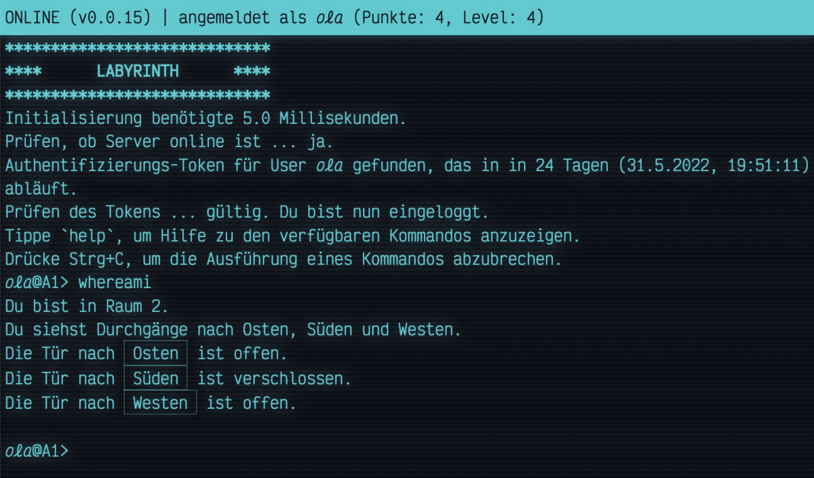

# Labyrinth

__An Escape Room like game which looks like an 80’s text adventure__

This is an escape game. Find your way through the labyrinth to the exit. The labyrinth is constructed from rooms which are interconnected by doors. To step through a door, it has to been opened first by typing in a password. The password is the solution of a riddle you have to solve. Once opened, a door stays open. All your data is stored on the server, so that your game session is restored each time you login. That means, you can play the game with the same state in different browsers.

## Background

This [software](https://github.com/raetselonkel/Labyrinth) consists of two parts: the [frontend](frontend) (what you can see above) and the [backend](backend) (a webservice giving access to the game data). The webservice has a [REST](https://en.wikipedia.org/wiki/Representational_state_transfer) [API](https://en.wikipedia.org/wiki/API) implemented in [Rust](https://rust-lang.org/). It’s connected to a [MongoDB](https://mongodb.com/) database, which stores the information about the rooms, the doors, the riddles, and you, the registered user. Users are authenticated by JSON Web Tokens ([JWT](https://jwt.io/)). 

*Labyrinth* is a private project by [Oliver Lau](mailto:oliver@ersatzworld.net).

## Contact

If you encounter problems with this software, please report them via the [GitHub project page](https://github.com/raetselonkel/Labyrinth). Feel free to leave encouraging and/or critical comments, or propose new features. If you've got a nice fresh idea for a new riddle, I'd be thankful if you contact me via [e-mail](mailto:oliver@ersatzworld.net).
